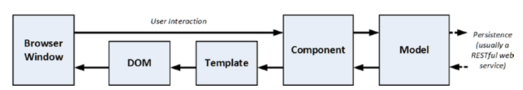

# Chapter 3 - Putting Angular in Context

The goal of Angular is to bring the tools and capabilities that have been available only for server-side development to the web client and, in doing so, make it easier to develop, test, and maintain rich and complex web applications.

The style of development that Angular supports is derived through the use of the Model-View-Controller (MVC) pattern.

## 3.1 Understanding Where Angular Excels

In broad terms, there are two kinds of web application: round-trip and single-page.

### 3.1.1 Understanding Round-Trip and Single-Page Applications

For a long time, web apps were developed to follow a round-trip model. The browser requests an initial HTML document from the server. User interactions—such as clicking a link or submitting a form—led the browser to request and receive a completely new HTML document. In this kind of application, the browser is essentially a rending engine for HTML content, and all of the application logic and data resides on the server. The browser makes a series of stateless HTTP requests that the server handles by generating HTML documents dynamically.

*Single-page applications* take a different approach. An initial HTML document is sent to the browser, but user interactions lead to Ajax requests for small fragments of HTML or data inserted into the existing set of elements being displayed to the user. 

*The main drawback of Angular is that there is an up-front investment in development time before you start to see results—something that is common in any MVC-based development. This initial investment is worthwhile, however, for complex apps or those that are likely to require significant revision and maintenance.*

## 3.2 Understanding the MVC Pattern

In recent years, the MVC pattern has been seen as a way to manage the growing richness and complexity of client-side web development as well, and it is in this
environment that Angular has emerged.

The key to applying the MVC pattern is to implement the key premise of a separation of concerns, in which the data model in the application is decoupled from the business and presentation logic. In clientside web development, this means separating the data, the logic that operates on that data, and the HTML elements used to display the data. The result is a client-side application that is easier to develop, maintain, and test.

The goal of the controller and the view is to operate on the data in the model in order to perform DOM manipulation so as to create and manage HTML elements that the user can interact with. Those interactions are fed back to the controller, closing the loop to form an interactive application.

Figure 3-4. The Angular implementation of the MVC pattern 

An Angular client takes on some of the complexity that would have otherwise existed at the server. This is generally a good thing because it offloads work from the server to the client, and that allows for more clients to be supported with less server capacity.

### 3.2.1 Understanding Models

Models—the M in MVC—contain the data that users work with. There are two broad types of model: 
* *view models*, which represent just data passed from the component to the template, and 
* *domain models*, which contain the data in a business domain, along with the operations, transformations, and rules for creating, storing, and manipulating that data, collectively referred to as the *model logic.*

*The goal of the MVC framework is to divide up an application into three functional areas, each of which may contain both logic and data.* The goal isn’t to eliminate logic from the model. rather, it is to ensure that the model contains logic only for creating and managing the model data.

The benefits of ensuring that the model is isolated from the controller and views are that you can test your logic more easily and that enhancing and maintaining
the overall application is simpler and easier.

The model in an application:
* Contain the domain data
* Contain the logic for creating, managing, and modifying the domain data (even if
that means executing remote logic via web services)
* Provide a clean API that exposes the model data and operations on it

The model should not:
* Expose details of how the model data is obtained or managed (in other words, details
of the data storage mechanism or the remote web service should not be exposed to controllers and views)
* Contain logic that transforms the model based on user interaction (because this is the component’s job)
* Contain logic for displaying data to the user (this is the template’s job)

### 3.2.2 Understanding Controllers/Components

<u>Controllers, which are known as components in Angular</u>, are the connective tissue in an Angular web app, acting as conduits between the data model and views. Components add business domain logic required to present some aspect of the model and perform operations on it. 

A component that follows the MVC pattern should:
* Contain the logic required to set up the initial state of the template
* Contain the logic/behaviors required by the template to present data from the model
* Contain the logic/behaviors required to update the model based on user interaction

A component should not:
* Contain logic that manipulates the DOM (that is the job of the template)
* Contain logic that manages the persistence of data (that is the job of the model)

#### 3.2.2.1 Understanding View Data

Components can create view data (also known as view model data or view models) to simplify templates and their interactions with the component.

### 3.2.3 Understanding Views/Templates

Views, which are known as templates in Angular, are defined using HTML elements that are enhanced by data bindings. It is the data bindings that make Angular so flexible, and they transform HTML elements into the foundation for dynamic web applications.

Templates should:
* Contain the logic and markup required to present data to the user

Templates should not:
* Contain complex logic (this is better placed in a component or one of the other Angular building blocks, such as directives, services, or pipes)
* Contain logic that creates, stores, or manipulates the domain model

Templates can contain logic, but it should be simple and used sparingly. 

*Putting anything but the simplest method calls or expressions in a template makes the overall application harder to test and maintain.*

## 3.3 Understanding RESTful Services

The logic for domain models in Angular apps is often split between the client and the server. The server contains the persistent store, typically a database, and contains the logic for managing it. In the case of a SQL database, for example, the required logic would include opening connections to the database server, executing SQL queries, and processing the results so they can be sent to the client.

You don’t want the client-side code accessing the data store directly—doing so would create a tight coupling between the client and the data store that would complicate unit testing and make it difficult to change the data store without also making changes to the client code as well.

By using the server to mediate access to the data store, you prevent tight coupling. The logic on the client is responsible for getting the data to and from the server and is unaware of the details of how that data
is stored or accessed behind the scenes.

The URL identifies the data object that I want to operate on, and the HTTP method specifies what operation I want performed.

## 3.4 Common Design Pitfalls

These are not coding errors but rather problems with the overall shape of the web app that prevent the project team from getting the benefits that Angular and the MVC pattern can provide.

### 3.4.1 Putting the Logic in the Wrong Place

* Putting business logic in templates, rather than in components
* Putting domain logic in components, rather than in the model
* Putting data store logic in the client model when using a RESTful service

Getting a feel for where logic should go takes some experience, but you’ll spot problems earlier if you are using unit testing because the tests you have to write to cover the logic won’t fit nicely into the MVC pattern.

Knowing where to put logic becomes second nature as you get more experience in Angular development, but here are the three rules:
* Template logic should prepare data only for display and never modify the model.
* Component logic should never directly create, update, or delete data from the
model.
* The templates and components should never directly access the data store.

### 3.4.2 Adopting the Data Store Data Format

In a well-designed Angular application that gets its data from a RESTful service, it is the job of the server to hide the data store implementation details and present the client with data in a suitable data format that favors simplicity in the client. 

### 3.4.3 Just Enough Knowledge to Cause Trouble

Angular is a complex framework that can be bewildering until you get used it. There are lots of different building blocks available, and they can be combined in different ways to achieve the similar results. This makes Angular development flexible and means you will develop your own style of problem-solving by creating combinations of features that suit your project and working style. 

The problem this presents, however, is that *becoming proficient in Angular takes time*. The temptation is to jump into creating your own projects before understanding how the different parts of Angular fit together. You might produce something that works without really understanding why it works, and that’s a recipe for disaster when you need to make changes. My advice is to go slow and take the time to understand all the features that Angular provides. By all means start creating projects early, but make sure you really understand how they work and be prepared to make changes as you find better ways of achieving the results you require.

## 3.5 Summary

